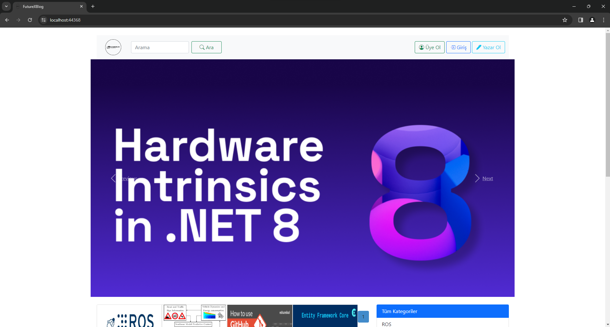
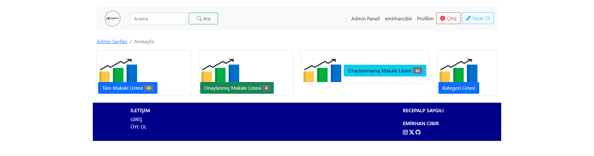
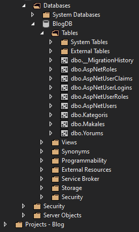
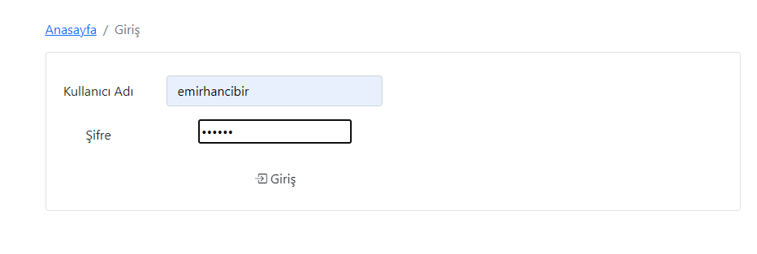
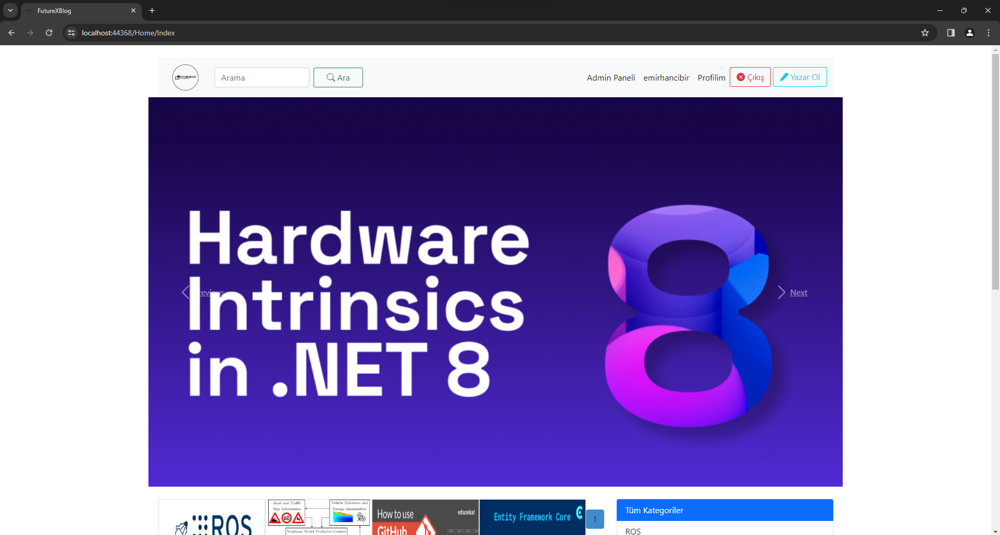
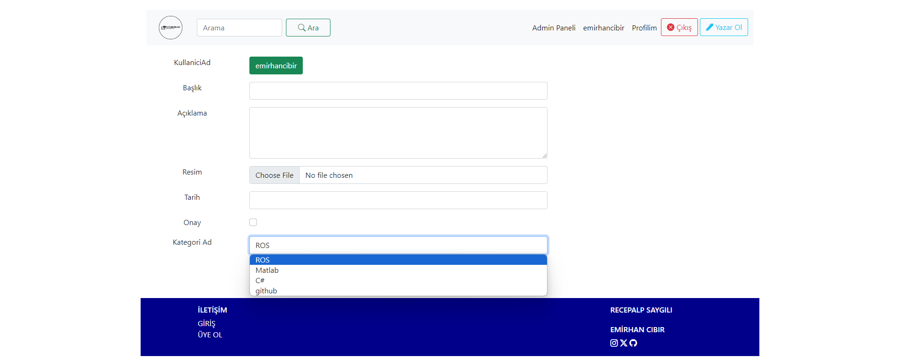
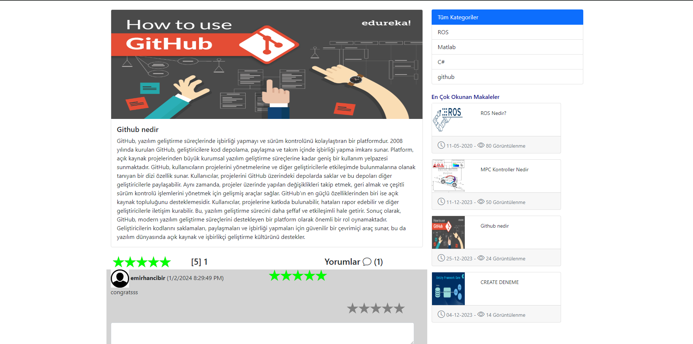

# ASP.NET MVC 5 Admin Panel and Blog Site Project

This project is developed using the ASP.NET MVC 5 (Model-View-Controller) design pattern, aiming to provide a user-friendly interface and a powerful admin panel for a blog site. The project utilizes modern web technologies to achieve its objectives.



## Project Features

- **Admin Panel:** A specially designed admin panel is used for tasks such as user management, managing blog posts, and handling comments.


- **Database Operations:** Entity Framework is used for database operations. The Code First approach is employed to automatically generate database tables.

  

- **Authentication and Authorization:** The authentication and authorization system, provided by Microsoft OWIN, supports secure login and logout processes.

    

- **Partial View Usage:** Modular page design is achieved using the Partial View structure, creating reusable components.

    

- **CSS and JavaScript Integration:** The user interface is customized with CSS, and dynamic features are added using JavaScript.

## Running the Project

1. Clone the project to your computer:
   ```bash
   git clone https://github.com/user/admin-panel-blog-site.git

2. Open the project using Visual Studio or a similar IDE.

3. Configure database connection settings:

   Update the database connection information in the <connectionStrings> section of the Web.config file.
4. Create the database:

   Open the Package Manager Console and run the Update-Database command to create the database.
5. Run the project:

   Press the F5 key or click the "Start" button in your IDE to run the project.

## Technologies and Tools Used

* ASP.NET MVC 5
* Entity Framework
* Microsoft OWIN
* CSS
* JavaScript
* HTML

    
   
  

## Contact
For questions or feedback regarding the project, please contact us.

### Project Owners: 
[Emirhan Cıbır](https://www.linkedin.com/in/emirhancibir/) \
[Recepalp Saygılı](https://www.linkedin.com/in/recepalp-sayg%C4%B1l%C4%B1-b2a0a0231/)
